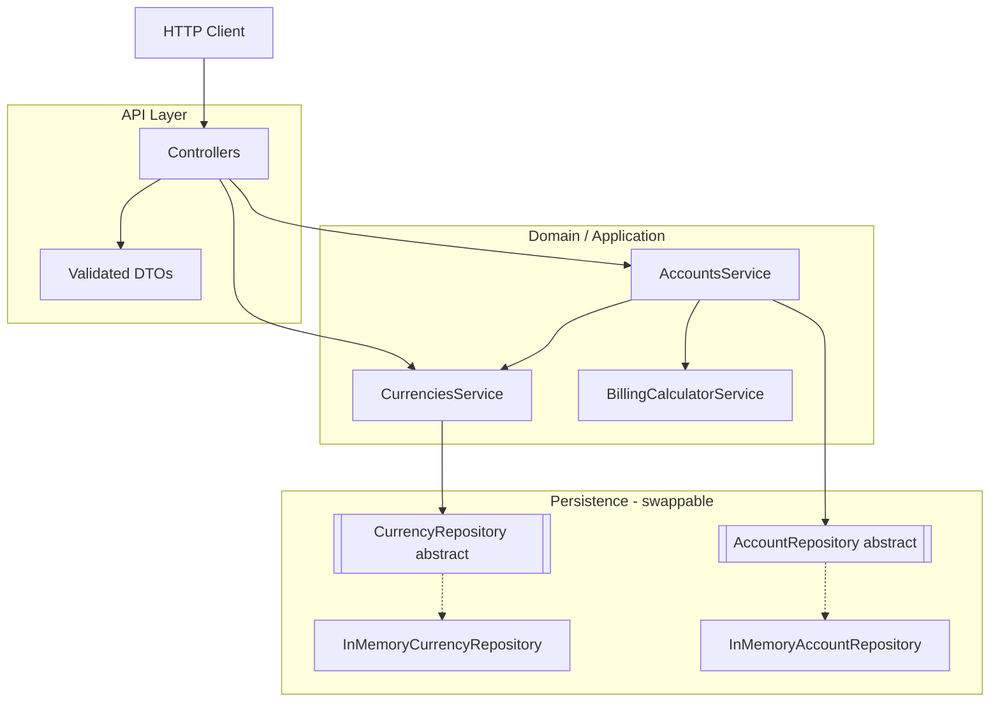
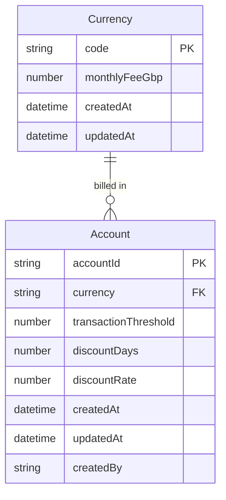

# BCB Billing Service

A NestJS + TypeScript REST API that calculates account bills from:

1. **Monthly base fee** (per currency, in GBP), prorated by calendar day
2. **Transaction fees** for every transaction above an account's monthly threshold
3. **Promotional discount** on the base fee for a fixed number of days after account creation

Storage is **in-memory** (no database required). The repository layer is designed so a Postgres implementation can be swapped in later with a one-line module change.

---

## Quick start

### Prerequisites

- Node.js 20+ (developed against Node 24)
- npm 10+

### Local development

```bash
cp .env.example .env
npm install
npm run start:dev
```

The API listens on `http://localhost:3000`. Interactive OpenAPI docs are at `http://localhost:3000/docs`.

### Docker

```bash
docker compose up --build
```

Same endpoints on port `3000`. Override `TRANSACTION_FEE_GBP` via a `.env` file or:

```bash
TRANSACTION_FEE_GBP=0.50 docker compose up --build
```

### Useful scripts

| Script | Purpose |
|---|---|
| `npm run start:dev` | Watch-mode development server |
| `npm run build` | Compile TypeScript to `dist/` |
| `npm run start:prod` | Run the compiled app |
| `npm test` | Unit tests |
| `npm run lint` | ESLint + Prettier |

---

## Configuration

| Variable | Default | Description |
|---|---|---|
| `PORT` | `3000` | HTTP port |
| `NODE_ENV` | `development` | `development` \| `production` \| `test` |
| `TRANSACTION_FEE_GBP` | `0.20` | GBP fee per transaction above an account's threshold |

Env vars are validated at bootstrap via `@nestjs/config` + `class-validator`. Invalid or missing values fail the process immediately.

---

## API overview

| Method | Path | Purpose |
|---|---|---|
| `GET` | `/` | Liveness check |
| `POST` | `/currencies` | Register a currency and its monthly base fee |
| `POST` | `/accounts` | Create a customer account |
| `POST` | `/accounts/:accountId/bill` | Calculate a bill for a billing period |

### Example flow (PowerShell)

```powershell
# 1. Register a currency
curl.exe -i -X POST http://localhost:3000/currencies -H "Content-Type: application/json" -d "{\"currency\":\"GBP\",\"monthlyFeeGbp\":20}"

# 2. Create an account (accountId optional — UUID is generated if omitted)
curl.exe -i -X POST http://localhost:3000/accounts -H "Content-Type: application/json" -d "{\"accountId\":\"acc-123\",\"currency\":\"GBP\",\"transactionThreshold\":100,\"discountDays\":10,\"discountRate\":20}"

# 3. Calculate a bill
curl.exe -i -X POST http://localhost:3000/accounts/acc-123/bill -H "Content-Type: application/json" -d "{\"billingPeriodStart\":\"2026-07-01\",\"billingPeriodEnd\":\"2026-08-01\",\"transactionCount\":150}"
```

### Example flow (bash)

```bash
# 1. Register a currency
curl -i -X POST http://localhost:3000/currencies \
  -H "Content-Type: application/json" \
  -d '{"currency":"GBP","monthlyFeeGbp":20}'

# 2. Create an account
curl -i -X POST http://localhost:3000/accounts \
  -H "Content-Type: application/json" \
  -d '{"accountId":"acc-123","currency":"GBP","transactionThreshold":100,"discountDays":10,"discountRate":20}'

# 3. Calculate a bill
curl -i -X POST http://localhost:3000/accounts/acc-123/bill \
  -H "Content-Type: application/json" \
  -d '{"billingPeriodStart":"2026-07-01","billingPeriodEnd":"2026-08-01","transactionCount":150}'
```

### Example bill response

```json
{
  "accountId": "acc-123",
  "currency": "GBP",
  "billingPeriodStart": "2026-07-01",
  "billingPeriodEnd": "2026-08-01",
  "breakdown": {
    "baseFee": {
      "monthlyFeeGbp": 20,
      "daysInPeriod": 31,
      "proratedAmountGbp": 20
    },
    "transactionFees": {
      "transactionCount": 150,
      "threshold": 100,
      "excessTransactions": 50,
      "feePerTransactionGbp": 0.2,
      "amountGbp": 10
    },
    "discount": {
      "discountRatePercent": 20,
      "discountDaysInPeriod": 10,
      "totalDaysInPeriod": 31,
      "discountableAmountGbp": 6.45,
      "discountAmountGbp": 1.29
    }
  },
  "subtotalGbp": 30,
  "totalGbp": 28.71
}
```

*(Discount figures assume the account was created on or near the start of the billing period so the full 10-day window overlaps. Exact overlap depends on `createdAt`.)*

---

## Architecture

Feature-based NestJS modules. Controllers talk to services; services depend on **abstract repository classes** (DI tokens), never on concrete storage.



### Project layout

```
src/
  config/          # Typed env config + validation (fails fast at boot)
  common/          # Shared exceptions, global filter, date/money utils
  currencies/      # Feature: POST /currencies
  accounts/        # Feature: POST /accounts, POST /accounts/:id/bill
  billing/         # Pure calculation engine (no HTTP, no repositories)
```

### Domain model (ER)



There is no persisted `Bill` entity — bills are calculated on demand from account + currency + request payload.

---

## How billing works

Billing periods are a **half-open** interval `[start, end)` measured in whole UTC calendar days.

### 1. Prorated base fee

For each day `d` in the period:

```
dailyBaseFee(d) = monthlyFeeGbp / daysInMonth(d)
```

Sum across all days → `proratedBaseFeeGbp`. Using each day's own month length means multi-month spans and leap years are handled correctly (no flat 30-day assumption).

### 2. Transaction fees

```
excess = max(0, transactionCount - transactionThreshold)
transactionFeesGbp = excess × TRANSACTION_FEE_GBP
```

Transactions below or at the threshold are free. The fee amount comes from config, not the request body.

### 3. Promotional discount (base fee only)

Discount window: `[account.createdAt, account.createdAt + discountDays)`.

Only the **base-fee portion** that falls on discount days is discounted. Transaction fees are charged in full.

```
discountAmountGbp = discountableBaseFeeGbp × (discountRate / 100)
totalGbp = (proratedBaseFeeGbp + transactionFeesGbp) - discountAmountGbp
```

Monetary amounts are rounded to 2 decimal places (pence) once at the end via `roundGbp()`.

### Worked example

| Input | Value |
|---|---|
| Monthly fee | £31 (convenient: £1/day in a 31-day month) |
| Billing period | 1 Jan 2026 → 1 Feb 2026 (31 days) |
| Transactions | 150 (threshold 100) → 50 excess |
| Fee per excess txn | £0.20 |
| Account created | 25 Jan 2026 |
| Discount | 10 days @ 50% |

**Step-by-step:**

1. **Base fee:** 31 days × £1 = **£31.00**
2. **Transaction fees:** 50 × £0.20 = **£10.00**
3. **Discount window:** 25 Jan – 3 Feb. Overlap with January bill = 25–31 Jan → **7 days**
4. **Discountable base fee:** 7 × £1 = **£7.00**
5. **Discount amount:** £7.00 × 50% = **£3.50**
6. **Subtotal:** £31 + £10 = **£41.00**
7. **Total:** £41.00 − £3.50 = **£37.50**

Transaction fees (£10) are **not** reduced by the discount.

---

## Proving correctness

Billing rules are covered by unit tests on `BillingCalculatorService` (full month, partial month, multi-month, leap year, threshold edges, discount fully/partially/not overlapping, base-fee-only discount). Run:

```bash
npm test
```

Swagger UI at `/docs` is also useful for interactive exploration of the three endpoints.
